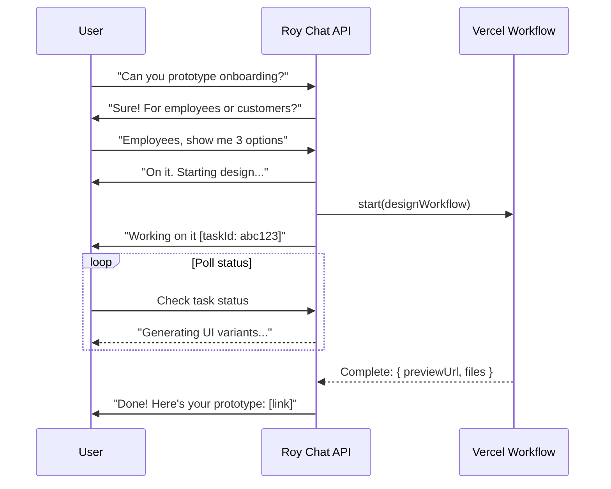
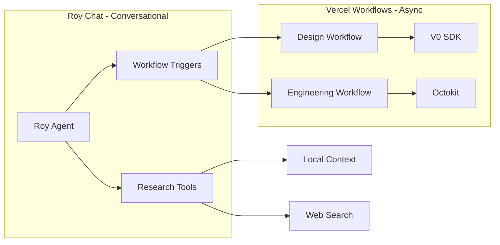

# Roy Hybrid Chat + Workflow Architecture

## Architecture



## How It Works

1. **Roy Chat** (`/api/chat`) handles all conversation - streaming, back-and-forth
2. **Tools** let Roy gather context (research) or kick off async work (design, engineering)
3. **Workflows** run long tasks durably - V0 generation, GitHub PRs
4. **UI** polls for workflow status and shows progress



## Why This Pattern?

- **Conversational**: Roy can ask clarifying questions before acting
- **Non-blocking**: Long tasks run async, user can keep chatting
- **Durable**: Workflows survive timeouts, crashes, rate limits
- **Simple**: Research/Q&A stays fast and inline

## Dependencies

```bash
pnpm add v0-sdk @v0-sdk/ai-tools @octokit/rest workflow
```

## Environment Variables

```env
V0_API_KEY=...           # From v0.app/chat/settings/keys
GITHUB_TOKEN=...         # PAT with repo scope
DEMO_REPO_OWNER=...      # e.g., "thinkhuman"
DEMO_REPO_NAME=...       # e.g., "roy-demo-workspace"
```

## File Structure

```
lib/roy/
├── workflows/
│   ├── index.ts              # Exports workflows
│   ├── design.ts             # V0 generation workflow (async)
│   └── engineering.ts        # GitHub PR workflow (async)
├── tools/
│   ├── index.ts              # Exports all tools
│   ├── research.ts           # searchContext, getOKRs, getTaskList (inline)
│   └── workflow-triggers.ts  # startDesign, startEngineering (kick off workflows)
├── integrations/
│   ├── v0.ts                 # V0 SDK client
│   └── github.ts             # Octokit client
└── system-prompt.ts          # Roy's personality + tool usage instructions

app/api/
├── chat/route.ts             # Main chat endpoint (streaming, conversational)
└── workflow/
    └── [id]/status/route.ts  # Poll workflow status
```

## 1. Chat Agent Tools (`lib/roy/tools/index.ts`)

Roy has access to both inline tools and workflow triggers:

```ts
import { tool } from "ai";
import { z } from "zod";
import { start } from "@vercel/workflow";
import { designWorkflow } from "../workflows/design";
import { engineeringWorkflow } from "../workflows/engineering";
import { searchLocalContext, getOKRs, getTaskList } from "./research";

export const royTools = {
  // === INLINE TOOLS (fast, run in request) ===

  searchContext: tool({
    description: "Search local context (OKRs, PRDs, meeting notes)",
    inputSchema: z.object({ query: z.string() }),
    execute: searchLocalContext,
  }),

  getOKRs: tool({
    description: "Get current OKRs and priorities",
    inputSchema: z.object({}),
    execute: getOKRs,
  }),

  getTaskList: tool({
    description: "Get current task list",
    inputSchema: z.object({}),
    execute: getTaskList,
  }),

  // === WORKFLOW TRIGGERS (async, run in background) ===

  startDesignTask: tool({
    description:
      "Start a design task - generates UI prototypes with V0. Use when user wants mockups, prototypes, or UI exploration.",
    inputSchema: z.object({
      task: z.string().describe("What to design"),
      requirements: z.string().optional().describe("Any specific requirements"),
    }),
    execute: async ({ task, requirements }) => {
      const { id } = await start(designWorkflow, {
        task,
        requirements,
      });
      return {
        workflowId: id,
        message: "Design task started. I'll let you know when it's ready.",
      };
    },
  }),

  startEngineeringTask: tool({
    description:
      "Start an engineering task - generates code and creates a PR. Use when user wants code changes or implementations.",
    inputSchema: z.object({
      task: z.string().describe("What to build"),
      files: z
        .array(z.string())
        .optional()
        .describe("Specific files to modify"),
    }),
    execute: async ({ task, files }) => {
      const { id } = await start(engineeringWorkflow, {
        task,
        targetFiles: files,
      });
      return {
        workflowId: id,
        message: "Engineering task started. I'll create a draft PR when ready.",
      };
    },
  }),

  checkWorkflowStatus: tool({
    description: "Check the status of a running workflow",
    inputSchema: z.object({ workflowId: z.string() }),
    execute: async ({ workflowId }) => {
      const res = await fetch(
        `${process.env.VERCEL_URL}/api/workflow/${workflowId}/status`
      );
      return res.json();
    },
  }),
};
```

## 2. Chat API Route (`app/api/chat/route.ts`)

Roy is the conversational agent with tool access:

```ts
import { streamText } from "ai";
import { openai } from "@ai-sdk/openai";
import { royTools } from "@/lib/roy/tools";
import { ROY_SYSTEM_PROMPT } from "@/lib/roy/system-prompt";

export async function POST(req: Request) {
  const { messages } = await req.json();

  const result = streamText({
    model: openai("gpt-4o"),
    system: ROY_SYSTEM_PROMPT,
    messages,
    tools: royTools,
    maxSteps: 5, // Allow multi-step tool use
  });

  return result.toDataStreamResponse();
}
```

## 3. Design Workflow (`lib/roy/workflows/design.ts`)

Uses V0 SDK for prototype generation:

```ts
"use workflow";

import { v0 } from "v0-sdk";

export async function designWorkflow(input: { task: string; context: any }) {
  "use step";
  // Step 1: Create project
  const project = await v0.projects.create({
    name: `Roy-${Date.now()}`,
  });

  ("use step");
  // Step 2: Generate prototype
  const chat = await v0.chats.create({
    projectId: project.id,
    message: input.task,
  });

  ("use step");
  // Step 3: Deploy for live preview
  const deployment = await v0.deployments.create({
    projectId: project.id,
    chatId: chat.id,
    versionId: chat.latestVersion.id,
  });

  return {
    type: "design",
    previewUrl: deployment.url,
    chatId: chat.id,
    projectId: project.id,
    files: chat.files,
  };
}
```

## 4. Engineering Workflow (`lib/roy/workflows/engineering.ts`)

Uses Octokit + PAT to create real PRs:

```ts
"use workflow";

import { Octokit } from "@octokit/rest";
import { generateText } from "ai";
import { openai } from "@ai-sdk/openai";

const octokit = new Octokit({ auth: process.env.GITHUB_TOKEN });
const owner = process.env.DEMO_REPO_OWNER!;
const repo = process.env.DEMO_REPO_NAME!;

export async function engineeringWorkflow(input: {
  task: string;
  targetFiles?: string[];
}) {
  "use step";
  // Step 1: Generate code changes with LLM
  const codeGen = await generateText({
    model: openai("gpt-4o"),
    system: ENGINEERING_SYSTEM_PROMPT,
    prompt: `Task: ${input.task}
${input.targetFiles ? `Target files: ${input.targetFiles.join(", ")}` : ""}

Generate file changes as JSON: [{ path, content }]`,
  });
  const files = JSON.parse(codeGen.text);

  ("use step");
  // Step 2: Get base branch ref
  const { data: ref } = await octokit.git.getRef({
    owner,
    repo,
    ref: "heads/main",
  });
  const baseSha = ref.object.sha;

  ("use step");
  // Step 3: Create new branch
  const branchName = `roy/${Date.now()}`;
  await octokit.git.createRef({
    owner,
    repo,
    ref: `refs/heads/${branchName}`,
    sha: baseSha,
  });

  ("use step");
  // Step 4: Create tree and commit
  const { data: newTree } = await octokit.git.createTree({
    owner,
    repo,
    base_tree: baseSha,
    tree: files.map((f: { path: string; content: string }) => ({
      path: f.path,
      mode: "100644",
      type: "blob",
      content: f.content,
    })),
  });

  const { data: commit } = await octokit.git.createCommit({
    owner,
    repo,
    message: `feat: ${input.task}`,
    tree: newTree.sha,
    parents: [baseSha],
  });

  await octokit.git.updateRef({
    owner,
    repo,
    ref: `heads/${branchName}`,
    sha: commit.sha,
  });

  ("use step");
  // Step 5: Create draft PR
  const { data: pr } = await octokit.pulls.create({
    owner,
    repo,
    title: input.task,
    head: branchName,
    base: "main",
    body: `Generated by Roy\n\n${input.task}`,
    draft: true,
  });

  return {
    type: "engineering",
    prUrl: pr.html_url,
    prNumber: pr.number,
    branch: branchName,
  };
}
```

## 5. Workflow Status Route (`app/api/workflow/[id]/status/route.ts`)

```ts
import { getStatus } from "@vercel/workflow";

export async function GET(
  req: Request,
  { params }: { params: { id: string } }
) {
  const status = await getStatus(params.id);
  return Response.json(status);
}
```

## 6. UI: Handling Async Workflows

When Roy starts a workflow, the tool returns a `workflowId`. The UI can:

1. **Show inline status** in the chat (Roy says "Working on it...")
2. **Poll for completion** and Roy reports results when done
3. **Show a background indicator** (the working badge)
```ts
// In useChat or roy-provider, track active workflows
const [activeWorkflows, setActiveWorkflows] =
  useState<Map<string, WorkflowStatus>>();

// When a tool result contains a workflowId, start polling
useEffect(() => {
  activeWorkflows.forEach((status, id) => {
    if (status.state === "running") {
      pollWorkflowStatus(id);
    }
  });
}, [activeWorkflows]);

// The chat agent handles reporting results naturally:
// - Tool returns { workflowId, message: "Started..." }
// - Roy says "I'm working on that..."
// - When workflow completes, Roy can check status and report
```


The key insight: **Roy handles this conversationally**. The user doesn't need to see raw workflow IDs - Roy just says "Working on it..." and then "Done! Here's your result."

## Demo Flow

### Scenario 1: Quick Research (Inline)

```
User: "What should I focus on this week?"
Roy: [uses searchContext, getOKRs, getTaskList tools]
Roy: "Based on your Q4 OKRs and recent meetings, your top priorities are:
     1. OLAP query performance - blocking the analytics team
     2. Onboarding flow redesign - due next Friday
     Would you like me to dive deeper into either?"
```

### Scenario 2: Design Task (Async Workflow)

```
User: "Can you prototype some onboarding options?"
Roy: "Sure! What type of onboarding - new employees or customers?"
User: "Employees. Show me 3 different approaches."
Roy: [uses startDesignTask tool]
Roy: "Got it. I'm generating 3 onboarding prototypes now. This usually
     takes about a minute - I'll let you know when they're ready."
     [workflow running indicator]
Roy: "Done! Here are your prototypes:
     - Option A (wizard): https://v0.dev/preview/abc123
     - Option B (checklist): https://v0.dev/preview/def456
     - Option C (contextual): https://v0.dev/preview/ghi789
     Which direction feels right?"
```

### Scenario 3: Engineering Task (Async Workflow)

```
User: "I like option B, can you implement it?"
Roy: "I'll create a draft PR with the checklist onboarding. Any specific
     files I should focus on, or should I create new components?"
User: "New components in /components/onboarding/"
Roy: [uses startEngineeringTask tool]
Roy: "On it. Creating the PR now..."
     [workflow running indicator]
Roy: "Done! Draft PR ready for review:
     https://github.com/thinkhuman/roy-demo/pull/42

     Created 3 new files:
     - components/onboarding/ChecklistOnboarding.tsx
     - components/onboarding/OnboardingStep.tsx
     - components/onboarding/useOnboardingProgress.ts"
```

## Setup Steps

1. **Create demo repo** on GitHub (e.g., `thinkhuman/roy-demo-workspace`)
2. **Get V0 API key** from v0.app/chat/settings/keys
3. **Create GitHub PAT** with `repo` scope
4. **Add env vars** to `.env.local`:
   ```env
   V0_API_KEY=...
   GITHUB_TOKEN=...
   DEMO_REPO_OWNER=thinkhuman
   DEMO_REPO_NAME=roy-demo-workspace
   ```

5. **Deploy to Vercel** with same env vars